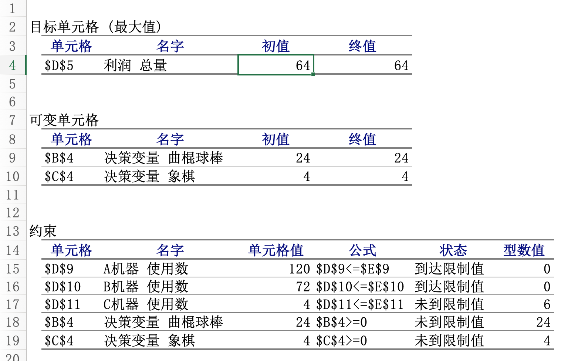
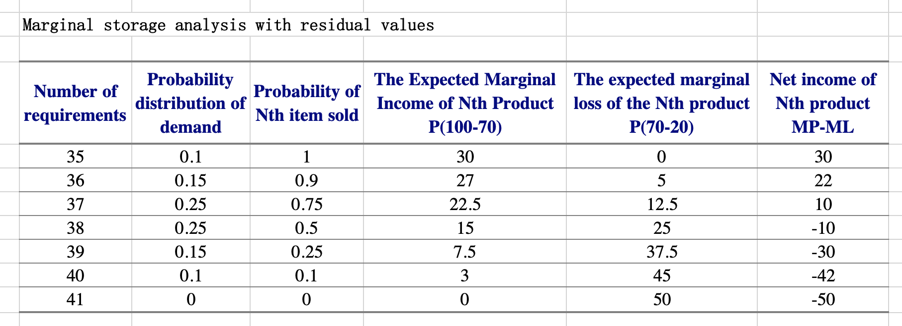

## Operations Management - Tongji MS&E 

This repository includes examples and slides in Prof. Qiu Chanhua's OM class. Notes for the examples are as follows.

- [LP Problem](#lp-problem)
  * [Simple LP problem](#simple-lp-problem)
  * [Transportation Problem](#transportation-problem)
- [Scheduling](#scheduling)
  * [Production planning examples](#production-planning-examples)
  * [Scheduling issues](#scheduling-issues)
  * [Production planning-cumulative curve method](#production-planning-cumulative-curve-method)
  * [Total production planning technology](#total-production-planning-technology)
- [Inventory Management - Problem](#inventory-management---problem)
- [Forecasting](#forecasting)
  * [Moving Averages](#moving-averages)
  * [Forecast Error Measures](#forecast-error-measures)
  * [Causal Relationships/Linear Regression](#causal-relationships-linear-regression)
  * [Time series decomposition](#time-series-decomposition)
  * [Exponential Smoothing](#exponential-smoothing)
  * [Second Exponential Smoothing Method](#second-exponential-smoothing-method)
- [Supply chain management - Problem](#supply-chain-management---problem)
- [Simulation](#simulation)
  * [Simulation Principle](#simulation-principle)
  * [Machine Maintenance Simulation-Example](#machine-maintenance-simulation-example)
  * [Tennessee Wagon Simulation-Example](#tennessee-wagon-simulation-example)
- [MRP](#mrp)


### LP Problem

#### Simple LP problem

We use the LP model of excel to solve the LP problem. Our preliminary work is to convert the LP problem into a standard format. 

```
Max     Z=2X+4Y
s.t.    4X+6Y<=120
        2X+6Y<=72
        Y<=10
        X,Y>=0
```


Then input the target cells, variable cells, and constraints into the scheduling model. Click scheduling and we can get the computing results.



#### Transportation Problem

Transportation Problem is a special LP problem. The core methodology is the same as beyond, which builds a linear programming problem and uses the LP scheduling model to solve it.


The first table contains the costs from factories to warehouses. The second table contains all variables that are transportation quantities. The third table computes the total cost which is also the basis of the objective function. Input these items input the scheduling model of excel and we can simply get the final result.


### Scheduling

#### Production planning examples


#### Scheduling issues


#### Production planning-cumulative curve method


In this production planning problem, we assume average daily output is a constant to simplify this problem. 

To minimize total inventory cost, we can calculate the average daily output which can make the ending inventory of this year zero. Then we can calculate the first table. 

```
3460 ton /242 day=14.30 Ton/day
```

However, we can see the ending inventory will lower than zero during Sep. to Nov. So, we need to adjust daily output. 

It's obvious ending inventory is the lowest in October. If we make it zero, ending inventory every month will be greater than zero.

```
3150 ton /203 day=15.517 Ton/day
```

Cumulative production equals to cumulative demand in October and cumulative production is always greater than cumulative demand during this year after adjustment.


#### Total production planning technology

In order to compute 


### Inventory Management - Problem

In this part, we take Newsvendor Model for example. As for this problem, we only need to compute the expected marginal income and the expected marginal loss. Net income = MP\*Probability-ML\*Probability

We can see from below that if the number of requirements is greater than 37, net income is cheaper than 0. So we should stock 37 pieces of products. 




### Forecasting

#### Moving Averages

Moving average is the most easy way for forecasting demand. We only need to calculate the average of the demand in the previous few weeks. This method is called the simple moving average method.

We can also take endow history demands different weight to calculate the weighted average. This method is called the weighted moving average method.


#### Forecast Error Measures

To measure the forecasting error, we need to take some values as indicators. 

**RSFE**: the running sum of forecast errors

**MAD**: Mean Absolute Deviation

**TS**: Time series


#### Causal Relationships/Linear Regression

In order to forecast the demand or the sales, we can also find the casusal relationships between them and other variable.

For example, the number of housing start permits have casusal relationships with the carpet sales.


In some cases, x and y may not have linear correlations. We need to replace y with different power-law index and compute the linear regression again.

#### Time series decomposition

Demands consist of average demand, trend, seasonal element, cyclical element, rand variation, autocorrelation. 

Time series can be defined as a series arranged in chronological order, which contains one or more influence factors of demand. 

Take the seasonal element as an example, we need to use seasonal coefficient to adjust sales. Sales may have linear correlations with time after adjustment.


#### Exponential Smoothing 

The recent data is more accurate than the earlier data in predicting the future, so the weight of the most recent data is more important than the weight of the previous data. So the exponential smoothing method is proposed. 

The next week’s forecast demand is equal to this week’s forecast demand minus this week’s actual demand times the smoothing parameter(0.1/0.6). 

Next week's forecast demand = This week's forecast demand + The deviation between forecast and actual demand this week * smooth parameter


#### Second Exponential Smoothing Method

In the case of a trend, the exponential smoothing method will lag, so the second exponential smoothing method can be used for prediction.
For the situation after the trend and seasonal fluctuations, it is necessary to use the three-exponential smoothing method to predict. We only introduce the secondary exponential smoothing method here.


### Supply chain management - Problem

Source:  ([Riskpool-example.xls](5.Supply-chain-management))


EOQ: Economic order quantity

We can use the same way to compute the average inventory of decentralized system and centralized system to maintain a 97% service level. Just compute the safty stock, ROP, and EOQ according to the leading time and history demand, the average inventory is easy to compute.


### Simulation

#### Simulation Principle


#### Machine Maintenance Simulation-Example


#### Tennessee Wagon Simulation-Example


### MRP


